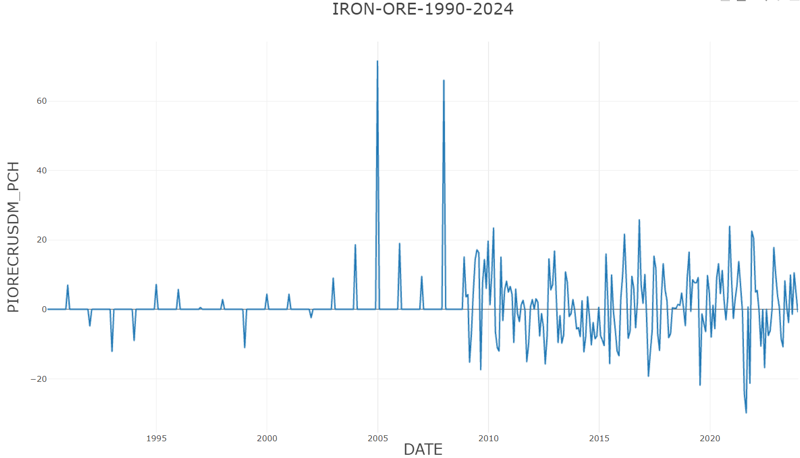
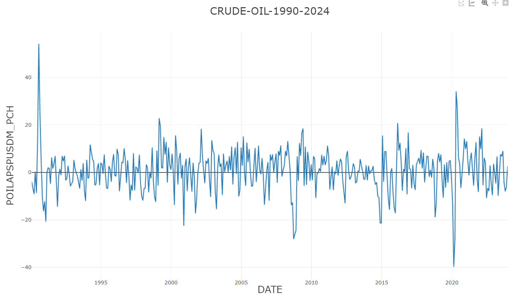

# 🔗 Fontes dos Datasets Utilizados

## ⛏ Commodities

### 🔧 Global price of Iron Ore

Foi escolhida a janela de tempo entre 1990-02-01 e 2024-01-01

Unidade: Mudança Percentual

https://fred.stlouisfed.org/series/PIORECRUSDM

### 🛢 Global price of APSP crude oil 

Foi escolhida a janela de tempo entre 1990-02-01 e 2024-01-01

Unidade: Mudança Percentual

https://fred.stlouisfed.org/series/POILAPSPUSDM

